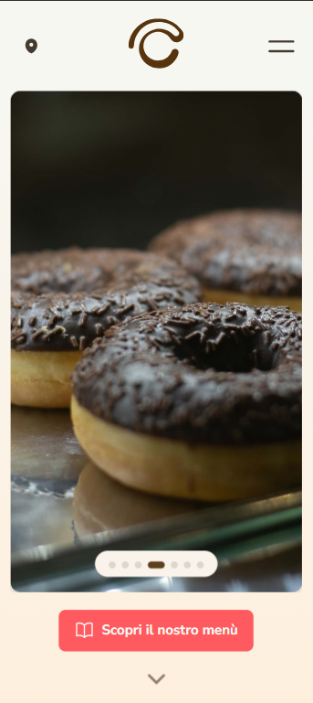
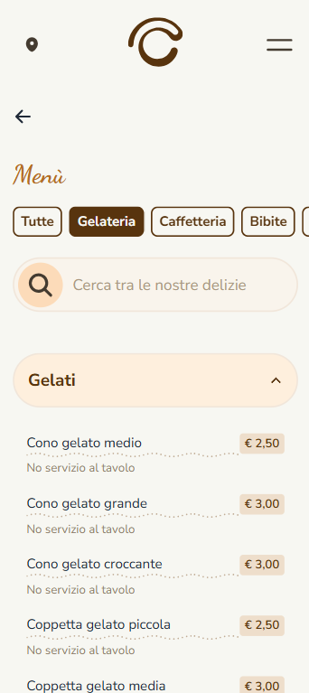

<h1 align="center">Crema e Cioccolato Barletta - Showcase and Menu site</h1>

<p align="center">
  
  
</p>

<p align="center">
  
</p>

---

Crema & Cioccolato is a renowned Italian company known for franchising ice cream parlors and coffee shops. This project showcases the delicacies and vibrant experience offered at the Barletta store in Puglia.

Please note that this project is an independent effort and is not officially affiliated with the Crema & Cioccolato franchising network. Instead, it is a collaboration with the family who proudly operates the Barletta location.

---

<br>
<a href="https://crema-cioccolato-bt.netlify.app/">
  <div align="center">
    
  </div>
</a>

<br>

<a href="https://crema-cioccolato-bt.netlify.app/">
  <div align="center">
    
    
  </div>
</a>

## Highlights

- 🧁 A straight forward homepage displaying some of the most requested items, FAQs and more shop's infos

- ✨ An interactive menu

  - 🥅 Category filtering: Filter available items in each of the 6 categories: 🍦 Icecreams, ☕ Coffee, 🥤 Drinks, 🥂Aperitivo, 🍕 Food & Snacks, 🍻 Beers & Liquors.
  - 🔎 Text search: Search the desired item by typing its name within a filtered category or in the whole menu
  - 🧺 Items grouping: products are grouped in subcategories to improve readability of over 100 items.

- 🎨 A basic but custom design system built on top of DaisyUI. Planned to expand and improve animations using Rive.

## Run it locally

```bash
pnpm run dev
```

Open [http://localhost:3000](http://localhost:3000) with your browser to see the result.

## Commit convention

Commits must follow the [Conventional Commits](https://www.conventionalcommits.org/en/v1.0.0/) specification.
Commitizen has been implemented to help you (aka. me) follow this convention.

To have a guidance on properly formatted commit messages you (again, talking to myself here) should use:

```bash
pnpm commit
# or, if you have commitizen installed globally on your machine:
git cz
```

Commitizen is configured to use the custom [cz-emoji-conventional](https://github.com/promet99/cz-emoji-conventional) adapter to achieve fancier commits. Emojis help in a sea of text afterall.
